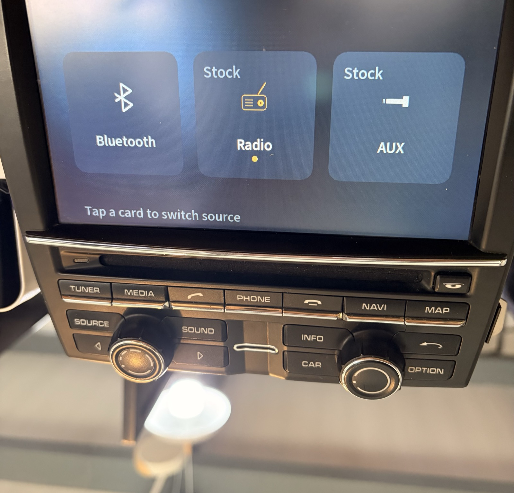

# porsche-pcm-studio

**A replacement media UI for the 2009 Porsche PCM 3.1 — self-drawn, running beside the stock firmware**

> Porsche PCM 3.1 (CHN) · QNX 6.3.2 · SH-4A · 800×480 · 2026-08
> **✅ Running on a bench unit: real track metadata, real transport control, real touch.**
>
> **English** · [简体中文](README.zh-CN.md)

> ⚠️ **Disclaimer**: For study/research only. It reads and writes another process's memory on a car
> computer. **Use at your own risk; don't blame me.**
> 仅供学习研究,后果自负。 Full text: [DISCLAIMER.md](DISCLAIMER.md) · License: [GPL-3.0](LICENSE)

> 🚩 **About "zero flash": read this before you believe the phrase.** An earlier version of this
> README claimed the project writes nothing to flash. That was **wrong**, and it is corrected below.
> The UI, the state reading and the Bluetooth transport controls really do need no flash writes.
> But **volume, source switching and tuner control drive the stock firmware's own control plane
> through a code cave that has to be flashed into IFS1 first**, and blocking the SOURCE hard key needs
> a second one in IFS2. Without them those commands return an error; everything else still works. See
> [What needs a flashed cave](#what-needs-a-flashed-cave).




*The source page, photographed on the bench unit. Studio started itself at power-on; the picture was
taken after one press of the physical SOURCE key. Radio is the active source (amber icon and dot);
Bluetooth is ours, Radio and AUX are handed back to the stock UI because their takeover switches are
off. Everything above the buttons is drawn by Studio on its own hardware layer.*

*Bench unit, Bluetooth playback page. Track name, artist, album, genre, elapsed/total and the phone's
name are all read live from the stock firmware; the transport buttons drive it back over MME.*

---

## What this is

The PCM 3.1 head unit draws its UI through a QNX `gf` graphics server. **Studio attaches as a second
`gf` client**, claims a hardware layer the stock firmware is not using, and draws its own 800×480
surface on top. The stock software keeps running underneath — it still owns the audio path, the
Bluetooth stack, the tuner and the persistence store. Studio replaces only what the driver *looks at*.

That choice is the whole design:

- **Studio itself is a normal process.** It reflashes nothing and patches no image on disk; the only
  files it writes are its own (its settings under `/HBpersistence/dev/etc/`, its log, its lock).
  **Cut power and the stock UI is back, untouched.**
  ⚠️ *Killing* it is not the same thing: `gf_layer_detach` is a no-op, so a killed process never
  returns the layer and its last frame stays on the screen until reboot, with the stock UI unable to
  cover it. Stop it with `touch /tmp/studio.stop`, never `slay`.
- **No forked firmware to maintain.** We read the stock software's state instead of reimplementing it.
- **The stock unit stays authoritative.** Volume, sources, tuner presets, phone book — all still the
  factory implementation. We are a presentation layer.

## What needs a flashed cave

Being a presentation layer has a limit: to *change* something (not just show it) we have to reach the
stock firmware's control plane, and some of that is only reachable from inside the stock process.

| | How it works | Needs flash? |
|---|---|---|
| Full-screen overlay, own hardware layer | second `gf` client | **no** |
| Reading stock state (page id, source, volume, track) | read-only `/proc/<pid>/as` mirror | **no** |
| Bluetooth play/pause, prev/next, shuffle, repeat | MME protocol, direct | **no** |
| Touch gate (stop the stock seeing touch) | one word in the stock's memory | **no** |
| Reading hard keys | read the stock's key mapper | **no** |
| **Volume** | stock control plane via a code cave | **yes — IFS1** |
| **Source switching** | stock control plane via a code cave | **yes — IFS1** |
| **Tuner (set frequency)** | stock control plane via a code cave | **yes — IFS1** |
| **Stopping the stock acting on a hard key** | `preProcessKey()` vtable slot → code cave | **yes — IFS2** |

Note the last two hard-key rows are different problems. *Reading* a key is free: the key code sits in
the stock mapper's memory and we mirror it. *Stopping* the stock from also acting on it is not — with
Studio covering the screen, pressing SOURCE would still cycle the stock's own source list underneath,
and the touch gate does not cover keys. The fix redirects one vtable slot into a code cave that
returns "handled" for a table of key codes, and it is **armed at runtime by the same word as the touch
gate**, so when Studio is not covering the screen the patched firmware behaves byte-for-byte like
stock. Today the table holds one entry: `0x0d`, SOURCE.

**Neither cave is in this repo, and neither is in the sibling project either.** Both are built by
tooling in the (unpublished) research workspace — the IFS1 "puppet" cave that carries volume, source
and tuner, and the IFS2 key gate. The sibling project
[porsche-pcm31-mods](https://github.com/WillCoder/porsche-pcm31-mods) flashes IFS1 too, but for
*different* caves (its Bluetooth boot-sound and lock-BT fixes); getting those does not get you these.
Without them those commands return an error and log it, and the stock keeps reacting to SOURCE — the
rest of the UI is unaffected.

`studio/platform/puppet_addr.h` is generated by that tooling, so the addresses compiled into Studio
and the bytes written to flash can never drift apart.

**Those addresses are specific to one firmware build on one bench unit** — they are published so the
code compiles and so the mechanism is readable, not so you can flash them somewhere else.

## Status

| Area | State |
|---|---|
| Bluetooth playback page | **Working on the bench** — metadata, progress, play/pause, prev/next, shuffle, repeat, touch |
| Source page | **Working on the bench** — the SOURCE hard key brings it up from anywhere; tapping a card really switches the source (that part needs the flashed cave) |
| Settings | **Working** — per-source "Studio takes over" toggles + language, written to disk immediately |
| Languages | **English (default)** and Simplified Chinese, switched live |
| Status bar | **Working** — clock, volume level and value, on every page |
| Input | **Touch only.** No focus ring, no cursor, no rotary selection anywhere — the volume knob is the one exception and is handled globally |
| Radio | Layout done, and preset/scale taps are wired to the tuner cave (`CMD_TUNE`) — **not yet verified on the bench** |
| AUX page | Skeleton — volume only |
| Real car (911 / 9x1) | **Not yet tried.** Bench only so far |
| Album art | **Impossible** over AVRCP 1.3 — see [docs/capabilities.md](docs/capabilities.md) |

## How it is put together

```
studio/
├── sys/
│   ├── pcm_caps.h        Capability contract — what the engine can and cannot do
│   ├── pcm_sys.h         The interface scenes are allowed to see
│   ├── plat_internal.h   Engine-only platform hooks (scenes cannot reach these)
│   ├── pcm_i18n.h        Every on-screen string (X-macro table; EN default + zh-CN)
│   ├── pcm_shell.c       Scene scheduling + the full-page vs partial redraw policy
│   └── shell_draw.c      Shell-owned drawing (transitions, overlays)
├── scenes/
│   ├── gfx.c             Platform-independent drawing library
│   └── scene_*.c         One file per page
├── platform/
│   ├── plat_pcm.c        Real hardware: gf layer, VRAM, state mirror, MME, touch gate
│   └── plat_mac.c        macOS: offline preview in a browser
├── main_pcm.c            Entry point on the head unit
├── main_mac.c            Entry point on the development machine
└── tools/                build.sh · bake_font.py · studio_server.py
```

**One source tree, two backends.** Scene code never sees a `gf` call or a `/proc` read; it asks
`plat_*` for a framebuffer, some state and a command channel. The macOS backend renders the same
pixels into a browser, so layout work happens off the hardware.

## The idea this project is actually built on

> **Boundaries belong in the code, not in the comments.**

Most of the wasted days on this project were not bugs. They were re-discovering, for the third time,
that something is impossible — or forgetting a rule that was written down but not enforced. So the
constraints live in the build now:

| Constraint | How it is enforced | Enforced by |
|---|---|---|
| Impossible commands | `CMD_SEEK` was deleted from the command enum, so a scrubber cannot be written at all | **Compiler** |
| Values that are often unavailable | Raw fields carry a `u_` prefix and are read through accessors that return "no value" — the unknown branch **must** be handled | **Compiler** |
| Patterns that fail silently | Colour macros in a ternary; hand-rolled `read()` loops; scenes reaching into engine internals; Chinese text hard-coded at a drawing call instead of going through the string table | **Build** (`lint_guards()` in [`tools/build.sh`](studio/tools/build.sh)) |
| Acting while invisible | If we are not covering the screen, no event reaches a scene and no command is sent — blocked at the two chokepoints, not per scene | **Engine structure** |
| Layout drift | Every button's drawn centre must land inside its own hit box; the dirty rect must cover what animates; an icon must not be wildly out of scale with the text beside it | **Startup self-check** |
| What the hardware can and cannot do | One authoritative, sourced list in [`pcm_caps.h`](studio/sys/pcm_caps.h) | **Review** — see note |

The "acting while invisible" row earned its place: in mirror mode a scene that was **not on
screen** interpreted a real touch with its own layout and drove `CMD_SET_SOURCE` through the puppet
cave — it actually switched the car's audio source. Putting the check in each scene would have been
the obvious fix and the wrong one; a scene can emit a command for reasons other than a touch.

> The first five rows are enforced by a machine. The last one is not: `pcm_caps.h` provides
> `#if CAP_X` and `PCM_REQUIRE_CAP()`, but almost nothing uses them yet, so the capability
> list is upheld by reading it. It is labelled that way in the file itself rather than
> overstated here.

A worked example. `CMD_SEEK` used to exist, with a comment next to it saying *"expected to fail on
Bluetooth, keep it off the main path"*. The comment stopped nobody — while it existed, somebody would
eventually build a drag-to-seek bar on it. Deleting the enum value made both backends fail to compile
until their dead implementations were removed. Now it cannot be written at all, and
[`pcm_caps.h`](studio/sys/pcm_caps.h) records why, with evidence.

## Documentation

| | |
|---|---|
| [docs/capabilities.md](docs/capabilities.md) | What it can do, what it cannot, and what is simply untested |
| [docs/hardware.md](docs/hardware.md) | The PCM 3.1 constraints that forced every design decision |
| [docs/build-and-deploy.md](docs/build-and-deploy.md) | Building both backends, baking the font, getting it onto a unit |

## Quick start (offline preview, no hardware)

```bash
python3 studio/tools/bake_font.py --body-font /path/to/NotoSansSC-var.ttf \
        --weight Medium --body-px 24 --charset gb2312 --bin studio/studio_notosc.fnt
bash studio/tools/build.sh mac
STUDIO_SCENE=btplay /tmp/pcm_studio_run
python3 studio/tools/studio_server.py     # then open http://localhost:8770
```

Fonts are not committed — they are derivatives of Noto Sans SC (SIL OFL) and the baker reproduces one
byte-for-byte from the command above. See [docs/build-and-deploy.md](docs/build-and-deploy.md).

## Related

[porsche-pcm31-mods](https://github.com/WillCoder/porsche-pcm31-mods) — the sibling repo: two shipped
firmware modifications for the same unit (a Bluetooth boot fix and a floating volume OSD) and the
reverse-engineering toolkit both were built with.
