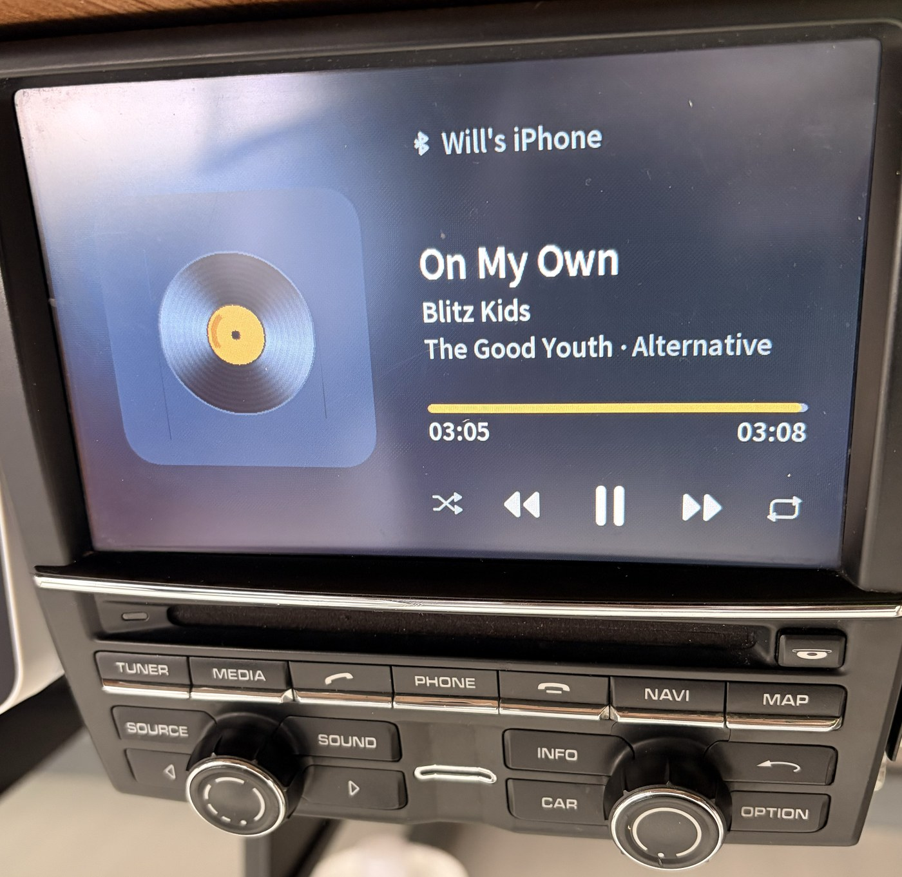

# porsche-pcm-studio

**A replacement media UI for the 2009 Porsche PCM 3.1 — self-drawn, running beside the stock firmware, with zero flash writes**

> Porsche PCM 3.1 (CHN) · QNX 6.3.2 · SH-4A · 800×480 · 2026-08
> **✅ Running on a bench unit: real track metadata, real transport control, real touch.**
>
> **English** · [简体中文](README.zh-CN.md)

> ⚠️ **Disclaimer**: For study/research only. This project itself writes **nothing** to flash — every
> change lives in RAM and is gone at the next power cycle — but it does read and write another
> process's memory on a car computer. **Use at your own risk; don't blame me.**
> 仅供学习研究,后果自负。 Full text: [DISCLAIMER.md](DISCLAIMER.md) · License: [GPL-3.0](LICENSE)



*Bench unit, Bluetooth playback page. Track name, artist, album, genre, elapsed/total and the phone's
name are all read live from the stock firmware; the transport buttons drive it back over MME.*

---

## What this is

The PCM 3.1 head unit draws its UI through a QNX `gf` graphics server. **Studio attaches as a second
`gf` client**, claims a hardware layer the stock firmware is not using, and draws its own 800×480
surface on top. The stock software keeps running underneath — it still owns the audio path, the
Bluetooth stack, the tuner and the persistence store. Studio replaces only what the driver *looks at*.

That choice is the whole design:

- **Zero flash writes.** Nothing is reflashed, nothing is patched on disk. Kill the process or cut
  power and the stock UI is back, untouched.
- **No forked firmware to maintain.** We read the stock software's state instead of reimplementing it.
- **The stock unit stays authoritative.** Volume, sources, tuner presets, phone book — all still the
  factory implementation. We are a presentation layer.

## Status

| Area | State |
|---|---|
| Bluetooth playback page | **Working on the bench** — metadata, progress, play/pause, prev/next, shuffle, repeat, touch |
| Radio / AUX / home / settings pages | Skeletons, layout only |
| Real car (911 / 9x1) | **Not yet tried.** Bench only so far |
| Album art | **Impossible** over AVRCP 1.3 — see [docs/capabilities.md](docs/capabilities.md) |

## How it is put together

```
studio/
├── sys/
│   ├── pcm_caps.h        Capability contract — what the engine can and cannot do
│   ├── pcm_sys.h         The interface scenes are allowed to see
│   ├── plat_internal.h   Engine-only platform hooks (scenes cannot reach these)
│   ├── pcm_shell.c       Scene scheduling + the full-page vs partial redraw policy
│   └── shell_draw.c      Shell-owned drawing (transitions, overlays)
├── scenes/
│   ├── gfx.c             Platform-independent drawing library
│   └── scene_*.c         One file per page
├── platform/
│   ├── plat_pcm.c        Real hardware: gf layer, VRAM, state mirror, MME, touch gate
│   └── plat_mac.c        macOS: offline preview in a browser
├── main_pcm.c            Entry point on the head unit
├── main_mac.c            Entry point on the development machine
└── tools/                build.sh · bake_font.py · studio_server.py
```

**One source tree, two backends.** Scene code never sees a `gf` call or a `/proc` read; it asks
`plat_*` for a framebuffer, some state and a command channel. The macOS backend renders the same
pixels into a browser, so layout work happens off the hardware.

## The idea this project is actually built on

> **Boundaries belong in the code, not in the comments.**

Most of the wasted days on this project were not bugs. They were re-discovering, for the third time,
that something is impossible — or forgetting a rule that was written down but not enforced. So the
constraints live in the build now:

| Constraint | How it is enforced | Enforced by |
|---|---|---|
| Impossible commands | `CMD_SEEK` was deleted from the command enum, so a scrubber cannot be written at all | **Compiler** |
| Values that are often unavailable | Raw fields carry a `u_` prefix and are read through accessors that return "no value" — the unknown branch **must** be handled | **Compiler** |
| Patterns that fail silently | Colour macros in a ternary; hand-rolled `read()` loops; scenes reaching into engine internals | **Build** (`lint_guards()` in [`tools/build.sh`](studio/tools/build.sh)) |
| Layout drift | Every button's drawn centre must land inside its own hit box; the dirty rect must cover what animates | **Startup self-check** |
| What the hardware can and cannot do | One authoritative, sourced list in [`pcm_caps.h`](studio/sys/pcm_caps.h) | **Review** — see note |

> The first four rows are enforced by a machine. The last one is not: `pcm_caps.h` provides
> `#if CAP_X` and `PCM_REQUIRE_CAP()`, but almost nothing uses them yet, so the capability
> list is upheld by reading it. It is labelled that way in the file itself rather than
> overstated here.

A worked example. `CMD_SEEK` used to exist, with a comment next to it saying *"expected to fail on
Bluetooth, keep it off the main path"*. The comment stopped nobody — while it existed, somebody would
eventually build a drag-to-seek bar on it. Deleting the enum value made both backends fail to compile
until their dead implementations were removed. Now it cannot be written at all, and
[`pcm_caps.h`](studio/sys/pcm_caps.h) records why, with evidence.

## Documentation

| | |
|---|---|
| [docs/capabilities.md](docs/capabilities.md) | What it can do, what it cannot, and what is simply untested |
| [docs/hardware.md](docs/hardware.md) | The PCM 3.1 constraints that forced every design decision |
| [docs/build-and-deploy.md](docs/build-and-deploy.md) | Building both backends, baking the font, getting it onto a unit |

## Quick start (offline preview, no hardware)

```bash
python3 studio/tools/bake_font.py --body-font /path/to/NotoSansSC-var.ttf \
        --weight Medium --body-px 24 --charset gb2312 --bin studio/studio_notosc.fnt
bash studio/tools/build.sh mac
STUDIO_SCENE=btplay /tmp/pcm_studio_run
python3 studio/tools/studio_server.py     # then open http://localhost:8770
```

Fonts are not committed — they are derivatives of Noto Sans SC (SIL OFL) and the baker reproduces one
byte-for-byte from the command above. See [docs/build-and-deploy.md](docs/build-and-deploy.md).

## Related

[porsche-pcm31-mods](https://github.com/WillCoder/porsche-pcm31-mods) — the sibling repo: two shipped
firmware modifications for the same unit (a Bluetooth boot fix and a floating volume OSD) and the
reverse-engineering toolkit both were built with.
